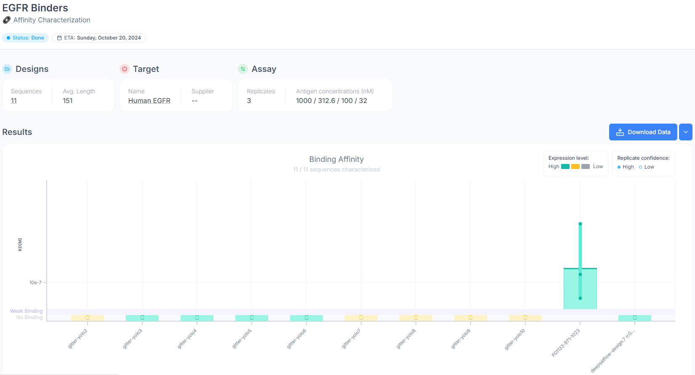

# Adaptyv Bio EGFR Protein Design Competition
Sequences and additional screening data from Adaptyv Bio's [EGFR Protein Design Competition](https://design.adaptyvbio.com/).
Copied from https://github.com/agitter/adaptyvbio-egfr by [Anthony Gitter](https://github.com/agitter).

## Round 1 second submission
I made a post-round 1 submission to Adaptyv for additional experimental screening that included 11 sequences (`round1-second-submission.fasta`):
- The 9 from [`round1-egfr-inhibitors.fasta`](https://github.com/agitter/adaptyvbio-egfr/blob/e812df235644f0a99f2075d2013ecd4b9aa851a9/round1-egfr-inhibitors.fasta) that were not selected by Adaptyv during the competition (all except `gitter-yolo1`, simply `yolo1` here)
- Human EGF
- An additional sequence from [@deepsatflow](https://x.com/deepsatflow/status/1838608857372733659)

Human EGF was suggested by [@btnaughton](https://x.com/btnaughton/status/1838659396337099172) and seconded by [@gottapatchemall](https://x.com/gottapatchemall/status/1838678445725036671).
It was of interest because many of the top-scoring designs by [iPAE](https://design.adaptyvbio.com/), including `gitter-yolo1`, were based on EGF but did not bind EGFR.
The specific sequence proposed was a 53 amino acid sequence from [UniProt](https://www.uniprot.org/uniprotkb/P01133/entry#PRO_0000007541).
This was the same sequence I obtained from [PDB 8HGS](https://www.rcsb.org/sequence/8hgs) for my submission and confirmed in [Bai 2023](https://doi.org/10.1038/s41421-023-00523-5).

`deepsatflow-design:7 n:0|mpnn:1.320|plddt:0.922|i_ptm:0.893|i_pae:4.337|rmsd:1.423` was created using methods in a separate GitHub [repository](https://github.com/deepsatflow/adaptyv-bio-pdc).
Briefly, it is a ColabFold workflow that involves [RFdiffusion](https://doi.org/10.1038/s41586-023-06415-8), [ProteinMPNN](https://doi.org/10.1126/science.add2187), and [AlphaFold-Multimer](https://doi.org/10.1101/2021.10.04.463034).

None of the designed round 1 second submissions bound EGFR.
Only the positive control, human EGF, bound the target.
See `round1-second-submission-data.csv` for the data table and the [`round1-second-submission-raw-data`](https://github.com/agitter/adaptyvbio-egfr/tree/e812df235644f0a99f2075d2013ecd4b9aa851a9/round1-second-submission-raw-data) subdirectory for the raw kinetic data.

The Adaptyv team noted that they ran this experiment at a higher starting concentration (1000 nM) compared to the competition.
Also, some of the sequences (e.g. `gitter-yolo3` and `gitter-yolo5`) exhibited aggregation.
